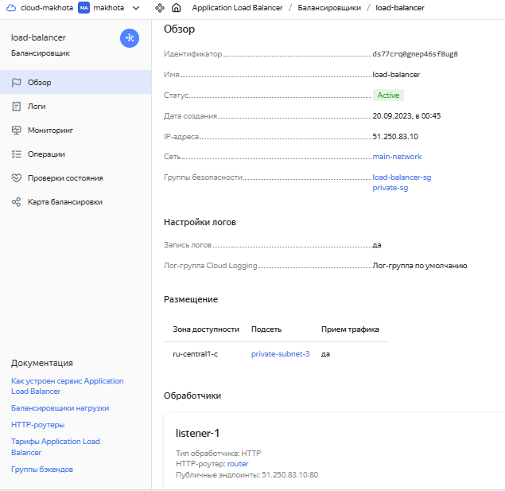
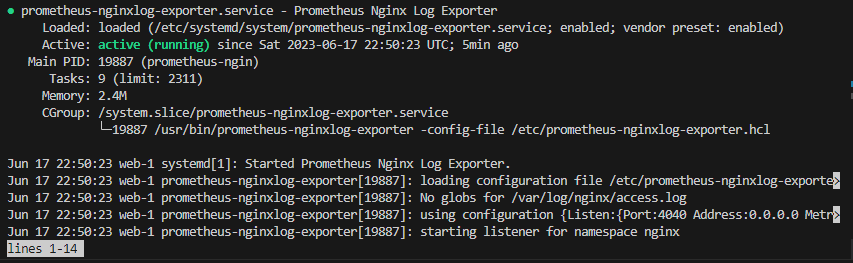

#  Дипломная работа по профессии «Системный администратор» - `Елена Махота`


### ПРОШУ ДАТЬ ВРЕМЯ ДЛЯ ДОРАБОТКИ

Содержание
==========
* [Задача](#Задача)
* [Инфраструктура](#Инфраструктура)
* [Сайт](#Сайт)
* [Мониторинг](#Мониторинг)
* [Логи](#Логи)
* [Сеть](#Сеть)
* [Резервное копирование](#Резервное-копирование)
 
---------
## Задача
Ключевая задача — разработать отказоустойчивую инфраструктуру для сайта, включающую мониторинг, сбор логов и резервное копирование основных данных. Инфраструктура должна размещаться в [Yandex Cloud](https://cloud.yandex.com/).

## Инфраструктура

### *План инфраструктуры*

## *[Сеть main-network](terraform/network.tf)*

    Внутренняя подсеть для сайта web-1 10.1.0.0/16 ru-central1-a
    Внутренняя подсеть для сайта web-2 10.2.0.0/16 ru-central1-b
    Внутренняя подсеть для сервисов Elasticsearch, Prometheus 10.3.0.0/16 ru-central1-c
    Публичная подсеть bastion host, Grafana, Kibana 10.4.0.0/16 ru-central1-c

## *[Группы](terraform/groups.tf)*

    Target Group - web-1, web-2 
    Backend Group = Target Group - web-1, web-2
    Security Groups для внутренней подсети, для балансировщика, bastion host, Grafana, Kibana 

## *Инстансы*

[web-1](/terraform/web-1.tf) |
[web-2](terraform/web-2.tf) |
[bastion](terraform/bastion.tf) |
[load-balancer](terraform/load-balancer.tf) |
[router](terraform/router.tf) |
[prometheus](terraform/prometheus.tf) |
[grafana](terraform/grafana.tf) |
[elasticsearch](terraform/elasticsearch.tf) |
[kibana](terraform/kibana.tf)


Для развёртки инфраструктуры использован [Terraform](terraform). 

Для установки сервисов использован [Ansible](ansible).


### Сайт
Создайно две ВМ в разных зонах посредством [Terraform](terraform): [web-1](terraform/web-1.tf), [web-2](terraform/web-2.tf). Использован специальный image Yandex Cloud с предустановленным docker

```tf
  boot_disk {
    initialize_params {
      image_id = data.yandex_compute_image.container-optimized-image.id
    }
  }
```

    web-1 10.1.0.10 ru-central1-a
    web-2 10.2.0.10 ru-central1-b

ОС и содержимое ВМ идентично, это веб-сервера.

На них установлен сервер nginx посредством playbook ansible в docker контейнере `image: "nginx:latest"`. 

ansible-playbook [web.yml](ansible/web.yml)


```bash
PLAY [Play nginx] *****************************************************************************************************

TASK [Gathering Facts] ************************************************************************************************
ok: [web-2]
ok: [web-1]

TASK [Install reqs for Docker] ****************************************************************************************
changed: [web-2]
changed: [web-1]

TASK [Install the Docker module for Python] ***************************************************************************
changed: [web-2]
changed: [web-1]

TASK [Create a directory /home/user/html if it does not exist] ********************************************************
changed: [web-1]
changed: [web-2]

TASK [Create a directory /var/log/nginx if it does not exist] *********************************************************
changed: [web-1]
changed: [web-2]

TASK [Copy index.html] ************************************************************************************************
changed: [web-1]
changed: [web-2]

TASK [Create container] ***********************************************************************************************
changed: [web-2]
changed: [web-1]

PLAY RECAP ************************************************************************************************************
web-1                      : ok=7    changed=6    unreachable=0    failed=0    skipped=0    rescued=0    ignored=0   
web-2                      : ok=7    changed=6    unreachable=0    failed=0    skipped=0    rescued=0    ignored=0  
```


Использован  статичный файл для сайта [index.html](ansible/index.html). Подтянут в docker через volume `- /home/user/html:/usr/share/nginx/html`.


Созданы Target Group, Backend Group [groups.tf](terraform/groups.tf).


Создан HTTP router [router.tf](terraform/router.tf).

Создан Application load balancer [load-balancer.tf](terraform/load-balancer.tf).



Сайт открывается с публичного IP балансера

### <a href = "http://158.160.97.33/" target="_blank">http://158.160.97.33/</a>


### Мониторинг

## *Установка prometheus*

ansible-playbook [prometheus.yml](ansible/prometheus.yml)

```bash
PLAY [Play prometheus] ************************************************************************************************

TASK [Gathering Facts] ************************************************************************************************
ok: [prometheus]

TASK [Create a directory if it does not exist] ************************************************************************
changed: [prometheus]

TASK [Copy dir] *******************************************************************************************************
changed: [prometheus]

TASK [Install prometheus] *********************************************************************************************
changed: [prometheus]

TASK [Print stdout] ***************************************************************************************************
ok: [prometheus] => {
    "result.stdout": "prometheus-2.40.1.linux-386/\nprometheus-2.40.1.linux-386/NOTICE\nprometheus-2.40.1.linux-386/prometheus\nprometheus-2.40.1.linux-386/LICENSE\nprometheus-2.40.1.linux-386/console_libraries/\nprometheus-2.40.1.linux-386/console_libraries/menu.lib\nprometheus-2.40.1.linux-386/console_libraries/prom.lib\nprometheus-2.40.1.linux-386/promtool\nprometheus-2.40.1.linux-386/prometheus.yml\nprometheus-2.40.1.linux-386/consoles/\nprometheus-2.40.1.linux-386/consoles/prometheus-overview.html\nprometheus-2.40.1.linux-386/consoles/prometheus.html\nprometheus-2.40.1.linux-386/consoles/node-cpu.html\nprometheus-2.40.1.linux-386/consoles/node-overview.html\nprometheus-2.40.1.linux-386/consoles/node-disk.html\nprometheus-2.40.1.linux-386/consoles/index.html.example\nprometheus-2.40.1.linux-386/consoles/node.html\n      - targets: [\"10.1.0.10:9100\", \"10.2.0.10:9100\"] "
}

PLAY RECAP ************************************************************************************************************
prometheus                 : ok=5    changed=3    unreachable=0    failed=0    skipped=0    rescued=0    ignored=0 
```

## *Установка node-exporter*

ansible-playbook [node-exporter.yml](ansible/node-exporter.yml)

```bash
PLAY [Play node-exporter] *********************************************************************************************

TASK [Gathering Facts] ************************************************************************************************
ok: [web-2]
ok: [web-1]

TASK [Create a directory if it does not exist] ************************************************************************
changed: [web-1]
changed: [web-2]

TASK [Copy dir] *******************************************************************************************************
changed: [web-1]
changed: [web-2]

TASK [Install node-exporter] ******************************************************************************************
changed: [web-1]
changed: [web-2]

TASK [Print stdout] ***************************************************************************************************
ok: [web-1] => {
    "result.stdout": "node_exporter-1.4.0.linux-amd64/\nnode_exporter-1.4.0.linux-amd64/LICENSE\nnode_exporter-1.4.0.linux-amd64/NOTICE\nnode_exporter-1.4.0.linux-amd64/node_exporter"
}
ok: [web-2] => {
    "result.stdout": "node_exporter-1.4.0.linux-amd64/\nnode_exporter-1.4.0.linux-amd64/LICENSE\nnode_exporter-1.4.0.linux-amd64/NOTICE\nnode_exporter-1.4.0.linux-amd64/node_exporter"
}

PLAY RECAP ************************************************************************************************************
web-1                      : ok=5    changed=3    unreachable=0    failed=0    skipped=0    rescued=0    ignored=0   
web-2                      : ok=5    changed=3    unreachable=0    failed=0    skipped=0    rescued=0    ignored=0   
```


## *Установка nginx-exporter*

ansible-playbook  [ngnginx-exporter.yml](ansible/nginx-exporter.yml)

```bash

PLAY [Play nginx-exporter] ********************************************************************************************

TASK [Gathering Facts] ************************************************************************************************
ok: [web-2]
ok: [web-1]

TASK [download nginx log exporter] ************************************************************************************
changed: [web-2]
changed: [web-1]

TASK [unarchive nginx log exporter] ***********************************************************************************
changed: [web-2]
changed: [web-1]

TASK [move nginx log exporter to /usr/bin] ****************************************************************************
changed: [web-2]
changed: [web-1]

TASK [copy  nginx log exporter config] ********************************************************************************
changed: [web-1]
changed: [web-2]

TASK [install unit file to systemd] ***********************************************************************************
changed: [web-2]
changed: [web-1]

TASK [nginxlog-exporter started] **************************************************************************************
changed: [web-2]
changed: [web-1]

PLAY RECAP ************************************************************************************************************
web-1                      : ok=7    changed=6    unreachable=0    failed=0    skipped=0    rescued=0    ignored=0   
web-2                      : ok=7    changed=6    unreachable=0    failed=0    skipped=0    rescued=0    ignored=0  
```




## *Установка grafana*

ansible-playbook [grafana.yml](ansible/grafana.yml)

```bash
PLAY [Play grafana] ***************************************************************************************************

TASK [Gathering Facts] ************************************************************************************************
ok: [grafana]

TASK [Create a directory if it does not exist] ************************************************************************
changed: [grafana]

TASK [Copy dir] *******************************************************************************************************
changed: [grafana]

TASK [Install grafana] ************************************************************************************************
changed: [grafana]

TASK [Print stdout] ***************************************************************************************************
ok: [grafana] => {
    "result.stdout": "Selecting previously unselected package grafana.\n(Reading database ... 29591 files and directories currently installed.)\nPreparing to unpack grafana_9.2.4_amd64.deb ...\nUnpacking grafana (9.2.4) ...\nReading package lists...\nBuilding dependency tree...\nReading state information...\nThe following NEW packages will be installed:\n  fontconfig-config fonts-dejavu-core libfontconfig1\n0 upgraded, 3 newly installed, 0 to remove and 1 not upgraded.\n1 not fully installed or removed.\nNeed to get 1,697 kB of archives.\nAfter this operation, 4,016 kB of additional disk space will be used.\nGet:1 http://mirror.yandex.ru/debian bullseye/main amd64 fonts-dejavu-core all 2.37-2 [1,069 kB]\nGet:2 http://mirror.yandex.ru/debian bullseye/main amd64 fontconfig-config all 2.13.1-4.2 [281 kB]\nGet:3 http://mirror.yandex.ru/debian bullseye/main amd64 libfontconfig1 amd64 2.13.1-4.2 [347 kB]\nPreconfiguring packages ...\nFetched 1,697 kB in 0s (9,480 kB/s)\nSelecting previously unselected package fonts-dejavu-core.\r\n(Reading database ... \r(Reading database ... 5%\r(Reading database ... 10%\r(Reading database ... 15%\r(Reading database ... 20%\r(Reading database ... 25%\r(Reading database ... 30%\r(Reading database ... 35%\r(Reading database ... 40%\r(Reading database ... 45%\r(Reading database ... 50%\r(Reading database ... 55%\r(Reading database ... 60%\r(Reading database ... 65%\r(Reading database ... 70%\r(Reading database ... 75%\r(Reading database ... 80%\r(Reading database ... 85%\r(Reading database ... 90%\r(Reading database ... 95%\r(Reading database ... 100%\r(Reading database ... 36822 files and directories currently installed.)\r\nPreparing to unpack .../fonts-dejavu-core_2.37-2_all.deb ...\r\nUnpacking fonts-dejavu-core (2.37-2) ...\r\nSelecting previously unselected package fontconfig-config.\r\nPreparing to unpack .../fontconfig-config_2.13.1-4.2_all.deb ...\r\nUnpacking fontconfig-config (2.13.1-4.2) ...\r\nSelecting previously unselected package libfontconfig1:amd64.\r\nPreparing to unpack .../libfontconfig1_2.13.1-4.2_amd64.deb ...\r\nUnpacking libfontconfig1:amd64 (2.13.1-4.2) ...\r\nSetting up fonts-dejavu-core (2.37-2) ...\r\nSetting up fontconfig-config (2.13.1-4.2) ...\r\nSetting up libfontconfig1:amd64 (2.13.1-4.2) ...\r\nSetting up grafana (9.2.4) ...\r\nAdding system user `grafana' (UID 108) ...\r\nAdding new user `grafana' (UID 108) with group `grafana' ...\r\nNot creating home directory `/usr/share/grafana'.\r\n### NOT starting on installation, please execute the following statements to configure grafana to start automatically using systemd\r\n sudo /bin/systemctl daemon-reload\r\n sudo /bin/systemctl enable grafana-server\r\n### You can start grafana-server by executing\r\n sudo /bin/systemctl start grafana-server\r\nProcessing triggers for libc-bin (2.31-13+deb11u5) ..."
}

PLAY RECAP ************************************************************************************************************
grafana                    : ok=5    changed=3    unreachable=0    failed=0    skipped=0    rescued=0    ignored=0 
```


## *Метрики в Grafana*

Добавление Dashboard в Grafana
В разделе Configuration > Data Sources > Add data sourcе
В появившемся списке > Prometheus > Save & Test
На сайте grafana.com найден нужный Dashboard [Node Exporter Full](https://grafana.com/grafana/dashboards/1860-node-exporter-full/) и скопирован его ID - 1860.
В поле Import via grafana.com  внесен скопированный ID 1860.
В выпадающем списке VictoriaMetrics выбран Prometheus > кнопка Import.

Метрики доступны по публичному IP сервера grafana:
### <a href = "http://51.250.41.248:3000" target="_blank">http://51.250.41.248:3000</a>

Логин `admin`, пароль `admin`.


Любую метрику, которую собирает `node-exporter (web:9100/metrics)` или `ngingxlog-exporter (web:4040/metrics)`, можно смотреть на Dashboard в Grafana: +new Dashboard > Add new Panel > metric


### Логи


## *Установка Elasticsearch*

ansible-playbook [elasticsearch.yml](ansible/elasticsearch.yml)

```bash
PLAY [Play elasticsearch] *********************************************************************************************

TASK [Gathering Facts] ************************************************************************************************
ok: [elasticsearch]

TASK [Install reqs for Docker] ****************************************************************************************
changed: [elasticsearch]

TASK [Install the Docker module for Python] ***************************************************************************
changed: [elasticsearch]

TASK [Create a directory /etc/elasticsearch/data if it does not exist] ************************************************
changed: [elasticsearch]


TASK [Create container elasticsearch] *********************************************************************************
changed: [elasticsearch]

PLAY RECAP ************************************************************************************************************
elasticsearch              : ok=5    changed=4    unreachable=0    failed=0    skipped=0    rescued=0    ignored=0 
```

Проверка результата установки:

```bash
curl -X GET 'localhost:9200/_cluster/health?pretty'
```


## *Установка kibana*

ansible-playbook [kibana-playbook.yml](ansible/kibana-playbook.yml)

```bash

PLAY [Play kibana] ****************************************************************************************************

TASK [Gathering Facts] ************************************************************************************************
ok: [kibana]

TASK [Install reqs for Docker] ****************************************************************************************
changed: [kibana]

TASK [Install the Docker module for Python] ***************************************************************************
changed: [kibana]

TASK [Create container] ***********************************************************************************************
changed: [kibana]

PLAY RECAP ************************************************************************************************************
kibana                     : ok=4    changed=3    unreachable=0    failed=0    skipped=0    rescued=0    ignored=0   
```

### Сеть
Развернута VPC.


Сервера web-1, web-2, Prometheus, Elasticsearch помещены в приватные подсети. 

Сервера Grafana, Kibana, application load balancer, bastion host определены в публичную подсеть.

Настроена Security Groups [groups.tf](terraform/groups.tf) соответствующих сервисов на входящий трафик только к нужным портам.


Настроена ВМ [bastion.tf](terraform/bastion.tf) с публичным адресом 51.250.41.10, в которой  открыт только один порт — ssh. 
Настроены все security groups на разрешение входящего ssh из этой security group. 
Эта вм  реализует концепцию bastion host. 
Можно  подключаться по ssh ко всем хостам через этот хост.

Пример - доступ через бастион к web-1:

```bash
ssh -i ~/.ssh/id_rsa -J user@51.250.41.10 user@10.1.0.10

```


В [hosts](ansible/hosts) ansible указано специальное правило подключения к хостам через bastion host:

```yml

[all:vars]
ansible_ssh_common_args='-o StrictHostKeyChecking=no -o UserKnownHostsFile=/dev/null -o ProxyCommand="ssh -W %h:%p -q 51.250.41.10"'

```

Настроена таблица маршрутизации для доступа из машин в локальной сети к интеренет через бастион [network.tf](terraform/network.tf).

```yaml
resource "yandex_vpc_gateway" "nat_gateway" {
  name = "test-gateway"
  shared_egress_gateway {}
}

resource "yandex_vpc_route_table" "route_table" {
  network_id = yandex_vpc_network.main-network.id

  static_route {
    destination_prefix = "0.0.0.0/0"
    gateway_id         = yandex_vpc_gateway.nat_gateway.id
  }
}
```


### Резервное копирование
Созданы snapshot дисков всех ВМ посредством `terraform` [snapshot.tf](terraform/snapshot.tf). 
Настроено ежедневное копирование.
Ограничено время жизни snaphot в неделю - число хранимых снимков 7. 


### Использованные источники
Документация Yandex Cloud по сетям и подсетям:

* <a href = "https://cloud.yandex.ru/docs/vpc/operations/network-create" target="_blank">Создание сети</a>
* <a href = "https://cloud.yandex.ru/docs/vpc/operations/subnet-create" target="_blank">Создание подсети</a>
* <a href = "https://cloud.yandex.ru/docs/vpc/operations/create-nat-gateway">Настройка Nat-шлюза</a>
* <a href = "https://cloud.yandex.ru/docs/vpc/operations/static-route-create">Статический маршрут</a>


Документация Yandex Cloud по Группам:

* <a href = "https://cloud.yandex.ru/docs/application-load-balancer/operations/target-group-create" target="_blank">Создать целевую группу Target Group для балансировщика</a>
* <a href = "https://cloud.yandex.ru/docs/application-load-balancer/operations/backend-group-create" target="_blank">Создать группу бэкендов Backend Group</a>
* <a href = "https://github.com/yandex-cloud/docs/blob/master/ru/vpc/operations/security-group-create.md" target="_blank">Создание Группы безопасности</a>
* <a href = "https://cloud.yandex.ru/docs/vpc/concepts/security-groups" target="_blank">Группы безопасности</a>
* <a href = "https://github.com/yandex-cloud/docs/blob/master/ru/managed-kubernetes/operations/connect/security-groups.md" target="_blank">Настройка групп безопасности</a>

Прочие:

* <a href = "https://cloud.yandex.ru/docs/cos/tutorials/coi-with-terraform" target="_blank">Создание VM с docker контенером</a>
* <a href = "https://dev.to/domysee/setting-up-a-reverse-proxy-with-nginx-and-docker-compose-29jg" target="_blank">Настройка nginx и docker-compose</a>
* <a href = "https://cloud.yandex.ru/docs/tutorials/routing/bastion" target="_blank">Создание бастиона</a>
* <a href = "https://cloud.yandex.ru/docs/application-load-balancer/operations/application-load-balancer-create" target="_blank">Создание L7-балансировщика</a>
* <a href = "https://cloud.yandex.ru/docs/application-load-balancer/operations/http-router-create" target="_blank">Создание HTTP-роутера для HTTP-трафика</a>
* <a href = "https://blog.ruanbekker.com/blog/2020/10/26/use-a-ssh-jump-host-with-ansible/" target="_blank">Использование Бастиона с Ansible</a>
* <a href = "https://docs.ansible.com/ansible/latest/collections/ansible/builtin/shell_module.html" target="_blank">Модули Ansible</a>
* <a href = "https://netology.ru/profile/program/srlb-14/lessons/223119/lesson_items/1207431" target="_blank">Презентация Нетологии Prometheus</a>
* <a href = "https://cloud.yandex.ru/docs/compute/operations/snapshot-control/create-schedule" target="_blank">Snapshots Yandex Cloud</a>
* <a href = "https://habr.com/ru/companies/otus/articles/542144/" target="_blank">habr Централизованное логирование в Docker с применением ELK Stack
</a>
* <a href = "https://daffin.ru/devops/docker/elk/" target="_blank">ELK stack</a>
* <a href = "https://www.elastic.co/guide/en/elasticsearch/reference/current/docker.html" target="_blank">Установка Elasticsearch с помощью Docker</a>
* <a href = "https://hub.docker.com/_/elasticsearch" target="_blank">https://hub.docker.com/_/elasticsearch</a>
* <a href = "https://www.sarulabs.com/post/5/2019-08-12/sending-docker-logs-to-elasticsearch-and-kibana-with-filebeat.html" target="_blank">https://www.sarulabs.com/post/5/2019-08-12/sending-docker-logs-to-elasticsearch-and-kibana-with-filebeat.html</a>

