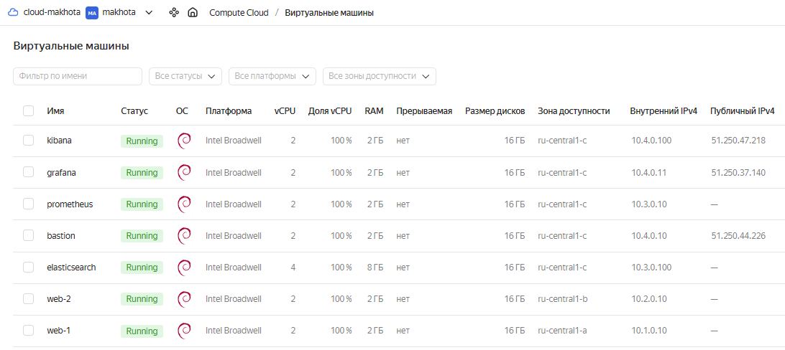
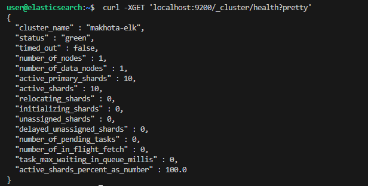

#  Дипломная работа по профессии «Системный администратор» - `Елена Махота`


Содержание
==========
* [Задача](#Задача)
* [Инфраструктура](#Инфраструктура)
* [Сайт](#Сайт)
* [Мониторинг](#Мониторинг)
* [Логи](#Логи)
* [Сеть](#Сеть)
* [Резервное копирование](#Резервное-копирование)
* [Использованные источники](#Использованные-источники)
 
---------
### <a name = "Задача"> Задача</a>
Ключевая задача — разработать отказоустойчивую инфраструктуру для сайта, включающую мониторинг, сбор логов и резервное копирование основных данных. Инфраструктура должна размещаться в [Yandex Cloud](https://cloud.yandex.com/).

### <a name = "Инфраструктура"> Инфраструктура </a>

### *План инфраструктуры*

## *[Сеть main-network](terraform/network.tf)*

    Внутренняя подсеть для сайта web-1 10.1.0.0/16 ru-central1-a
    Внутренняя подсеть для сайта web-2 10.2.0.0/16 ru-central1-b
    Внутренняя подсеть для сервисов Elasticsearch, Prometheus 10.3.0.0/16 ru-central1-c
    Публичная подсеть bastion host, Grafana, Kibana 10.4.0.0/16 ru-central1-c

## *[Группы](terraform/groups.tf)*

    Target Group - web-1, web-2 
    Backend Group = Target Group - web-1, web-2
    Security Groups для внутренней подсети, для балансировщика, bastion host, Grafana, Kibana 

## *Инстансы*

[web-1, web-2](terraform/web-servers.tf) |
[bastion](terraform/bastion.tf) |
[load-balancer](terraform/load-balancer.tf) |
[router](terraform/router.tf) |
[prometheus](terraform/prometheus.tf) |
[grafana](terraform/grafana.tf) |
[elasticsearch](terraform/elasticsearch.tf) |
[kibana](terraform/kibana.tf)





Для развёртки инфраструктуры использован [Terraform](terraform). 

```bash
terraform apply
```


Для установки сервисов использован [Ansible](ansible).

inventory-файл [ansible/hosts](ansible/hosts)  сгенерирован прямо из terraform, c  помощью ресурса local_file [terraform/local_files.tf](terraform/local_files.tf) и  шаблона inventory-файла [hosts.tpl](terraform/templates/hosts.tpl).


ansible-playbook [playbook.yml](ansible/playbook.yml)


История установки сохранена в тестовых файлах [tests](tests).

### <a name = "Сайт"> Сайт </a>

### <a href = "http://51.250.83.10/" target="_blank">http://51.250.83.10/</a>


Создайно две ВМ в разных зонах посредством [Terraform](terraform): [web-servers.tf](terraform/web-servers.tf). 
Поскольку это похожие ресурсы, то  в переменных [variables.tf](terraform/variables.tf)  создан map, ключом в котором является имя сервера, а значения  содержет зону, подсеть, IP-адрес:

```
locals {
  web-servers = {
   "web-1" = { zone = "ru-central1-a", subnet_id  = yandex_vpc_subnet.private-subnet-1.id, ip_address = "10.1.0.10" },
   "web-2" = { zone = "ru-central1-b", subnet_id  = yandex_vpc_subnet.private-subnet-2.id, ip_address = "10.2.0.10" }
 }
}
```

После этого, чтобы не описывать несколько похожих ресурсов, в одном ресурсе `yandex_compute_instance` [web-servers.tf](terraform/web-servers.tf) использован цикл `for_each`.

id образа вынесен в переменную [variables.tf](terraform/variables.tf) и использован конкретный id - fd81ojtctf7kjqa3au3i - Debian 11.


```tf
resource "yandex_compute_instance" "web-servers" {
  for_each    = local.web-servers
  hostname    = each.key
  name        = each.key
  zone        = each.value.zone

  resources {
    cores  = 2
    memory = 2
  }

  boot_disk {
    initialize_params {
      image_id = var.image_id
      type     = "network-ssd"
      size     = "16"    
      }
  }

  network_interface {
    subnet_id  = each.value.subnet_id
    security_group_ids = [yandex_vpc_security_group.private-sg.id]
    ip_address         = each.value.ip_address
  }

  metadata = {
    user-data = "${file("./meta.txt")}"
  }


} 
```


В результате созданы веб-сервера:

    web-1 10.1.0.10 ru-central1-a
    web-2 10.2.0.10 ru-central1-b

ОС и содержимое ВМ идентично.

На них установлены c помощью playbook ansible  [web-playbook.yml](ansible/web-playbook.yml):
- nginx 1.18.0 с использованием роли [geerlingguy.nginx](ansible/roles/geerlingguy.nginx)
- [node_exporter](ansible/roles/node_exporter)
- [nginx-exporter](ansible/roles/nginx-exporter) 
- [filebeat](ansible/roles/filebeat)


Использован  файл для сайта [index.html](ansible/roles/geerlingguy.nginx/files/index.html), сгенерирован c подстановкой ip адресов автоматически из terraform, c  помощью ресурса local_file [terraform/local_files.tf](terraform/local_files.tf) и  шаблона  [index.tpl](terraform/templates/index.tpl).


Созданы Target Group, Backend Group [groups.tf](terraform/groups.tf).


Так как создание nginx-серверов реализовано через цикл for each, то для автоматического добавления всех имеющихся nginx-серверов к балансировке использован мета-аргумент dynamic.

```
resource "yandex_alb_target_group" "tg-group" {
  name = "tg-group"
  
  dynamic "target" {
    for_each = local.web-servers
    content {
      ip_address = target.value.ip_address
      subnet_id  = target.value.subnet_id

    }
  }
  
}
```


Создан HTTP router [router.tf](terraform/router.tf).

Создан Application load balancer [load-balancer.tf](terraform/load-balancer.tf).


Сайт открывается с публичного IP балансера


### <a href = "http://51.250.83.10/" target="_blank">http://51.250.83.10/</a>


Cайт протестирован `curl -v 51.250.83.10:80`

output
```
> curl -v 51.250.83.10:80
ПОДРОБНО: GET http://51.250.83.10/ with 0-byte payload
ПОДРОБНО: received 2557-byte response of content type text/html


StatusCode        : 200
StatusDescription : OK
Content           : <!doctype html>
                    <html>
                    <head>
                        <meta http-equiv="Content-type" content="text/html; charset=utf-8">
                        <meta http-equiv="X-UA-Compatible" content="IE=Edge">
                        <title>sys-diplom-makhota</title>

                        <style ty...
RawContent        : HTTP/1.1 200 OK
                    Accept-Ranges: bytes
                    Content-Length: 2557
                    Content-Type: text/html
                    Date: Wed, 20 Sep 2023 19:08:54 GMT
                    ETag: "650b3b0c-9fd"
                    Last-Modified: Wed, 20 Sep 2023 18:33:48 GMT
                    Server: y...
Forms             : {}
Headers           : {[Accept-Ranges, bytes], [Content-Length, 2557], [Content-Type, text/html], [Date, Wed, 20 Sep 2023 19:08:54 GMT]... 
                    }
Images            : {}
InputFields       : {}
Links             : {@{innerHTML=Grafana; innerText=Grafana; outerHTML=<a class="btn btn-white btn-animated" href="http://51.250.37.140: 
                    3000/" target="_blank">Grafana</a>; outerText=Grafana; tagName=A; class=btn btn-white btn-animated; href=http://51.2 
                    50.37.140:3000/; target=_blank}, @{innerHTML=Kibana; innerText=Kibana; outerHTML=<a class="btn btn-white btn-animate 
                    d" href="http://51.250.47.218:5601/app/discover" target="_blank">Kibana</a>; outerText=Kibana; tagName=A; class=btn  
                    btn-white btn-animated; href=http://51.250.47.218:5601/app/discover; target=_blank}}
ParsedHtml        : System.__ComObject
RawContentLength  : 2557
```


### <a name = "Мониторинг"> Мониторинг </a>

Prometheus установлен автоматически при помощи [ansible/prometheus-playbook.yml](ansible/prometheus-playbook.yml) с использованием роли [ansible/roles/prometheus](ansible/roles/prometheus)  и переменных, через которые добавлены jobs и targets для 
node-exporter и ngnginx-exporter:

```yml
---
# Prometheus
# https://github.com/prometheus-community/ansible/tree/main/roles/prometheus

- name: Play prometheus
  hosts: prometheus
  roles:
  - node_exporter
  - prometheus
  vars:
    prometheus_targets:
      node:
      - targets:
        - "{{ groups['web'][0] }}:9100"
        - "{{ groups['web'][1] }}:9100"
        - "{{ hostvars['prometheus'].ansible_host }}:9100"
        - "{{ hostvars['grafana'].ansible_host }}:9100"
        - "{{ hostvars['elasticsearch'].ansible_host }}:9100"
        - "{{ hostvars['kibana'].ansible_host }}:9100"


      nginx:
      - targets:
        - "{{ groups['web'][0] }}:4040"
        - "{{ groups['web'][1] }}:4040"

    prometheus_scrape_configs:
      - job_name: "node"
        file_sd_configs:
          - files:
              - "{{ prometheus_config_dir }}/file_sd/node.yml"
      - job_name: "nginx"
        file_sd_configs:
          - files:
              - "{{ prometheus_config_dir }}/file_sd/nginx.yml"
```


node-exporter установлен на все вм с помощью роли [ansible/roles/node_exporter](ansible/roles/node_exporter) - # https://github.com/prometheus-community/ansible/tree/main/roles/node_exporter.


nginx-exporter установлен на [web-servers](ansible/web-playbook.yml)  при помощи роли [ansible/roles/nginx-exporter](ansible/roles/nginx-exporter) - # https://github.com/martin-helmich/prometheus-nginxlog-exporter.


Grafana ставится автоматически при помощи [ansible/grafana-playbook.yml](ansible/grafana-playbook.yml) с использованием роли [ansible/roles/cloudalchemy.grafana](ansible/roles/cloudalchemy.grafana)  и переменных, через которые добавлены нужные дашборды и алерты, логин и пароль:

```yml
---
# grafana
# https://github.com/cloudalchemy/ansible-grafana
# for Russia change install.yml in tasks
# - name: install Grafana
#   apt:
#     deb: https://dl.grafana.com/oss/release/grafana_10.1.1_amd64.deb


- name: Play grafana
  hosts: grafana
  become: yes
  roles:
  - node_exporter
  - cloudalchemy.grafana
  vars:
    grafana_version: 10.1.1
    
    grafana_security:
      admin_user: admin
      admin_password: 12345

    grafana_datasources:
      - name: prometheus
        type: prometheus
        access: proxy
        url: "http://{{ hostvars['prometheus'].ansible_host }}:9090"
        basicAuth: false
    
    grafana_dashboards:
      - dashboard_id: 1860
        revision_id: 31
        datasource: prometheus

      - dashboard_id: 15947
        revision_id: 1
        datasource: prometheus

    grafana_alert_notifications:
      notifiers:
        - name: Channel 1
          type: email
          uid: channel1
          is_default: false
          send_reminder: false
          settings:
            addresses: "Litande@mail.ru"
            autoResolve: true
      delete_notifiers:
        - name: Channel 2
          uid: channel2
```

## *Метрики в Grafana*

Метрики доступны по публичному IP сервера grafana:
### <a href = "http://51.250.37.140:3000" target="_blank">http://51.250.37.140:3000</a>

### Логин `admin`, пароль `12345`.


### <a name = "Логи"> Логи </a>


Elasticsearch, kibana-playbook и filebeats установлены автоматически через ansible плейбуки и роли с использованием шаблонов:

- [ansible/elasticsearch-playbook.yml](ansible/elasticsearch-playbook.yml)
- [ansible/kibana-playbook.yml](ansible/kibana-playbook.yml)
- [ansible/roles/filebeat](ansible/roles/filebeat)

Бинарные файлы для установки скачиваются с зеркала Яндекс:

https://mirror.yandex.ru/mirrors/elastic/8/pool/main/

Статус кластера - green.



Сконфигурировано соединение `kibana` c `elasticsearch` посредством передачи шаблона `kibana.yml`` через ansible [kibana-playbook.yml](ansible/kibana-playbook.yml):

[kibana.yml.j2](ansible/roles/kibana/templates/kibana.yml.j2)


Настроена доставка логов `nginx` в `elasticsearch` посредством передачи шаблона `filebeat.yml` через ansible [web-playbook.yml](ansible/web-playbook.yml):

[filebeat.yml.j2](ansible/roles/filebeat/templates/filebeat.yml.j2)

```yml
...

filebeat.inputs:
- type: filestream
  id: my-filestream-id
  enabled: true
  paths:
    - /var/log/nginx/access.log
    - /var/log/nginx/error.log

setup.kibana:
  host: "http://10.4.0.100:5601"

output.elasticsearch:
  hosts: ["10.3.0.100:9200"]

...

```


Логи подтянулись автоматически и доступны по публичному IP сервера kibana:
### <a href = "http://51.250.47.218:5601/app/discover" target="_blank">http://51.250.47.218:5601</a>


### <a name = "Сеть"> Сеть </a>
Развернута VPC.

[terraform/network.tf](terraform/network.tf)

```tf
### Сеть ###

resource "yandex_vpc_network" "main-network" {
  name        = "main-network"
  description = "network for diplom"
}


### Настройка Nat-шлюза и статический маршрут через бастион для внутренней сети ###

resource "yandex_vpc_gateway" "nat_gateway" {
  name = "test-gateway"
  shared_egress_gateway {}
}

resource "yandex_vpc_route_table" "route_table" {
  network_id = yandex_vpc_network.main-network.id

  static_route {
    destination_prefix = "0.0.0.0/0"
    gateway_id         = yandex_vpc_gateway.nat_gateway.id
  }
}


### Внутренняя подсеть для сайта 1 ###

resource "yandex_vpc_subnet" "private-subnet-1" {
  name           = "private-subnet-1"
  description    = "subnet for web-1"
  v4_cidr_blocks = ["10.1.0.0/16"]
  zone           = "ru-central1-a"
  network_id     = yandex_vpc_network.main-network.id
  route_table_id = yandex_vpc_route_table.route_table.id

}

### Внутренняя подсеть для сайта 2 ###

resource "yandex_vpc_subnet" "private-subnet-2" {
  name           = "private-subnet-2"
  description    = "subnet for web-2"
  v4_cidr_blocks = ["10.2.0.0/16"]
  zone           = "ru-central1-b"
  network_id     = yandex_vpc_network.main-network.id
  route_table_id = yandex_vpc_route_table.route_table.id
}

### Внутренняя подсеть для сервисов ###

resource "yandex_vpc_subnet" "private-subnet-3" {
  name           = "private-subnet-3"
  description    = "subnet for services"
  v4_cidr_blocks = ["10.3.0.0/16"]
  zone           = "ru-central1-c"
  network_id     = yandex_vpc_network.main-network.id
  route_table_id = yandex_vpc_route_table.route_table.id
}

### Публичная подсеть для бастиона, графаны, кибаны ###

resource "yandex_vpc_subnet" "public-subnet" {
  name           = "public-subnet"
  description    = "subnet for bastion"
  v4_cidr_blocks = ["10.4.0.0/16"]
  zone           = "ru-central1-c"
  network_id     = yandex_vpc_network.main-network.id
}

```


Сервера web-1, web-2, Prometheus, Elasticsearch помещены в приватные подсети. 

Сервера Grafana, Kibana, application load balancer, bastion host определены в публичную подсеть.

Настроена Security Groups [groups.tf](terraform/groups.tf) соответствующих сервисов на входящий трафик только к нужным портам.


Настроена ВМ [bastion.tf](terraform/bastion.tf) с публичным адресом 51.250.44.226, в которой  открыт только один порт — ssh. 
Настроены все security groups на разрешение входящего ssh из этой security group. 
Эта вм  реализует концепцию bastion host. 
Можно  подключаться по ssh ко всем хостам через этот хост.

Пример - доступ через бастион к web-1:

```bash
ssh -i ~/.ssh/id_rsa -J 51.250.44.226 user@10.1.0.10

```


В [hosts](ansible/hosts) ansible указано специальное правило подключения к хостам через bastion host:

```yml

[all:vars]
ansible_ssh_common_args='-o StrictHostKeyChecking=no -o UserKnownHostsFile=/dev/null -o ProxyCommand="ssh -W %h:%p -q 51.250.44.226"'

```

Настроена таблица маршрутизации для доступа из машин в локальной сети к интеренет через бастион [network.tf](terraform/network.tf).

```yaml
resource "yandex_vpc_gateway" "nat_gateway" {
  name = "test-gateway"
  shared_egress_gateway {}
}

resource "yandex_vpc_route_table" "route_table" {
  network_id = yandex_vpc_network.main-network.id

  static_route {
    destination_prefix = "0.0.0.0/0"
    gateway_id         = yandex_vpc_gateway.nat_gateway.id
  }
}
```


### <a name = "Резервное-копирование"> Резервное копирование </a>
Созданы snapshot дисков всех ВМ посредством `terraform` [snapshot.tf](terraform/snapshot.tf). 
Настроено ежедневное копирование.
Ограничено время жизни snaphot в неделю - число хранимых снимков 7. 

Так как создание nginx-серверов реализовано через цикл for each, то создание snapshot для них также описано через цикл.

```
resource "yandex_compute_snapshot_schedule" "snapshot2" {
  for_each    = local.web-servers
  name = "snapshot-${each.key}"

  schedule_policy {
    expression = "0 0 ? * *"
  }

  snapshot_count = 7

  snapshot_spec {
    description = "daily-snapshot"
  }

  disk_ids = [yandex_compute_instance.web-servers[each.key].boot_disk.0.disk_id]
  
}
```


### <a name = "Использованные-источники"> Использованные источники </a>


Документация Yandex Cloud по сетям и подсетям:

- <a href = "https://cloud.yandex.ru/docs/vpc/operations/network-create" target="_blank">Создание сети</a>
- <a href = "https://cloud.yandex.ru/docs/vpc/operations/subnet-create" target="_blank">Создание подсети</a>
- <a href = "https://cloud.yandex.ru/docs/vpc/operations/create-nat-gateway">Настройка Nat-шлюза</a>
- <a href = "https://cloud.yandex.ru/docs/vpc/operations/static-route-create">Статический маршрут</a>


Документация Yandex Cloud по Группам:

- <a href = "https://cloud.yandex.ru/docs/application-load-balancer/operations/target-group-create" target="_blank">Создать целевую группу Target Group для балансировщика</a>
- <a href = "https://cloud.yandex.ru/docs/application-load-balancer/operations/backend-group-create" target="_blank">Создать группу бэкендов Backend Group</a>
- <a href = "https://github.com/yandex-cloud/docs/blob/master/ru/vpc/operations/security-group-create.md" target="_blank">Создание Группы безопасности</a>
- <a href = "https://cloud.yandex.ru/docs/vpc/concepts/security-groups" target="_blank">Группы безопасности</a>
- <a href = "https://github.com/yandex-cloud/docs/blob/master/ru/managed-kubernetes/operations/connect/security-groups.md" target="_blank">Настройка групп безопасности</a>

Прочие:

- <a href = "https://dev.to/domysee/setting-up-a-reverse-proxy-with-nginx-and-docker-compose-29jg" target="_blank">Настройка nginx и docker-compose</a>
- <a href = "https://cloud.yandex.ru/docs/tutorials/routing/bastion" target="_blank">Создание бастиона</a>
- <a href = "https://cloud.yandex.ru/docs/application-load-balancer/operations/application-load-balancer-create" target="_blank">Создание L7-балансировщика</a>
- <a href = "https://cloud.yandex.ru/docs/application-load-balancer/operations/http-router-create" target="_blank">Создание HTTP-роутера для HTTP-трафика</a>
- <a href = "https://blog.ruanbekker.com/blog/2020/10/26/use-a-ssh-jump-host-with-ansible/" target="_blank">Использование Бастиона с Ansible</a>
- <a href = "https://docs.ansible.com/ansible/latest/collections/ansible/builtin/shell_module.html" target="_blank">Модули Ansible</a>
- <a href = "https://netology.ru/profile/program/srlb-14/lessons/223119/lesson_items/1207431" target="_blank">Презентация Нетологии Prometheus</a>
- <a href = "https://cloud.yandex.ru/docs/compute/operations/snapshot-control/create-schedule" target="_blank">Snapshots Yandex Cloud</a>
- <a href = "https://daffin.ru/devops/docker/elk/" target="_blank">ELK stack</a>
- <a href = "https://developer.hashicorp.com/terraform/language/meta-arguments/for_each" target="_blank">https://developer.hashicorp.com/terraform/language/meta-arguments/for_each</a>
- <a href = "https://thenewstack.io/how-to-use-terraforms-for_each-with-examples/" target="_blank">How to Use Terraform’s ‘for_each’, with Examples</a>
- <a href = "https://developer.hashicorp.com/terraform/language/expressions/dynamic-blocks" target="_blank">dynamic Blocks</a>
- <a href = "https://docs.comcloud.xyz/providers/hashicorp/local/latest/docs/resources/file" target="_blank">local_file (Resource)</a>
- <a href = "https://developer.hashicorp.com/terraform/language/functions/templatefile" target="_blank">templatefile Function</a>
- <a href = "https://stackoverflow.com/questions/45489534/best-way-currently-to-create-an-ansible-inventory-from-terraform" target="_blank">Best way currently to create an ansible inventory from terraform</a>
- <a href = "https://stackoverflow.com/questions/66716192/create-inventory-file-from-terraform-when-for-each-is-used" target="_blank">Create Inventory File from Terraform when for_each is used</a>
- <a href = "https://stackoverflow.com/questions/23656458/elasticsearch-what-to-do-with-unassigned-shards" target="_blank">elasticsearch - what to do with unassigned shards</a>
- <a href = "https://yandex.ru/video/preview/17910479584929116863" target="_blank">Filebeat with Elasticsearch 8.x - Part 1: Install and Secure</a>
 


